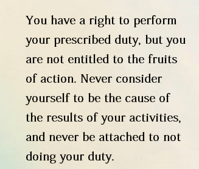

## 📝 Projects I worked on

| Category           | Project                                                                                           |
| ------------------ | ------------------------------------------------------------------------------------------------- |
| 🌐 Website          | <ul><li>[Repomix](https://github.com/yamadashy/repomix)</li> <li> [Surf.new](https://github.com/steel-dev/surf.new) </li> <li> [Cursor Linux Packages](https://github.com/PaperBoardOfficial/cursor-linux-packages) </li><li>TBD </li> </ul>                  |
| 🔌 Chrome Extension | <ul><li>[Nanobrowser](https://github.com/nanobrowser/nanobrowser) </li><li> [MSEdgeTTS](https://github.com/yacine-bens/MsEdge-TTS-Extension) </li> <li>TBD</li></ul> |
| 🆚 VSCode Extension | <ul><li>[Roo Code](https://github.com/RooCodeInc/Roo-Code) </li> <li>TBD</li></ul> |
| 📱 Mobile App       | <ul><li> [Fruit](https://github.com/PaperBoardOfficial/Fruit)   </li> <li> TBD </li> </ul>                                       |
| 💻 Library          | <ul><li>[Browser Use](https://github.com/browser-use/browser-use)   </li> <li> [SuperGlue](https://github.com/superglue-ai/superglue) </li> <li> TBD </li></ul>                                   |
